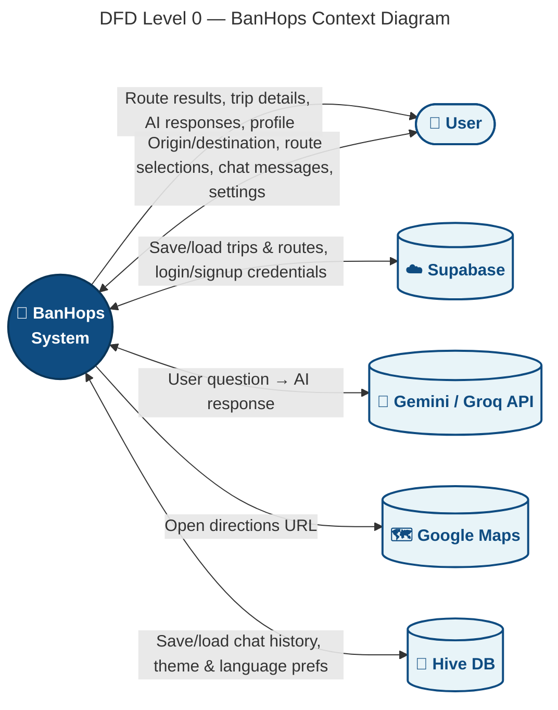

# BanHops — DFD Level 0 (Context Diagram)

```mermaid
---
title: DFD Level 0 — BanHops Context Diagram
---
flowchart LR
    classDef system fill:#0F4C81,stroke:#0a3558,stroke-width:2px,color:#fff,font-weight:bold,font-size:16px
    classDef external fill:#e8f4f8,stroke:#0F4C81,stroke-width:2px,color:#0F4C81,font-weight:bold

    System(("📍 BanHops<br/>System")):::system

    User(["👤 User"]):::external
    Supabase[("☁️ Supabase")]:::external
    AI[("🤖 Gemini / Groq API")]:::external
    Maps[("🗺️ Google Maps")]:::external
    Hive[("💾 Hive DB")]:::external

    User <-->|"Origin/destination, route selections, chat messages, settings"| System
    System -->|"Route results, trip details, AI responses, profile"| User

    System <-->|"Save/load trips & routes, login/signup credentials"| Supabase
    System <-->|"User question → AI response"| AI
    System -->|"Open directions URL"| Maps
    System <-->|"Save/load chat history, theme & language prefs"| Hive
```
