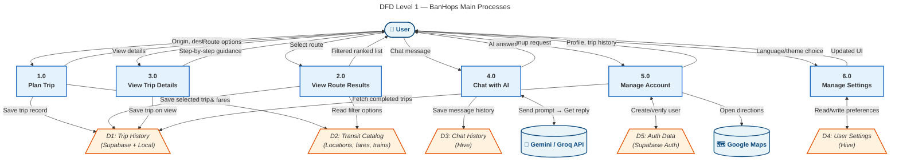

```mermaid
---
title: DFD Level 1 — BanHops Main Processes
---
flowchart TB
    classDef process fill:#e3f2fd,stroke:#1565c0,stroke-width:2px,color:#333,font-weight:bold
    classDef store fill:#fff3e0,stroke:#e65100,stroke-width:2px,color:#333,font-style:italic
    classDef external fill:#e8f4f8,stroke:#0F4C81,stroke-width:2px,color:#0F4C81,font-weight:bold

    %% External Entities
    User(["👤 User"]):::external
    AI[("🤖 Gemini / Groq API")]:::external
    Maps[("🗺️ Google Maps")]:::external

    %% Data Stores
    DS1[/"D1: Trip History<br/>(Supabase + Local)"\]:::store
    DS2[/"D2: Transit Catalog<br/>(Locations, fares, trains)"\]:::store
    DS3[/"D3: Chat History<br/>(Hive)"\]:::store
    DS4[/"D4: User Settings<br/>(Hive)"\]:::store
    DS5[/"D5: Auth Data<br/>(Supabase Auth)"\]:::store

    %% Processes
    P1["1.0<br/>Plan Trip"]:::process
    P2["2.0<br/>View Route Results"]:::process
    P3["3.0<br/>View Trip Details"]:::process
    P4["4.0<br/>Chat with AI"]:::process
    P5["5.0<br/>Manage Account"]:::process
    P6["6.0<br/>Manage Settings"]:::process

    %% User → Processes
    User -->|"Origin, destination"| P1
    User -->|"Select route"| P2
    User -->|"View details"| P3
    User -->|"Chat message"| P4
    User -->|"Login/signup request"| P5
    User -->|"Language/theme choice"| P6

    %% Processes → User
    P1 -->|"Route options"| User
    P2 -->|"Filtered ranked list"| User
    P3 -->|"Step-by-step guidance"| User
    P4 -->|"AI answer"| User
    P5 -->|"Profile, trip history"| User
    P6 -->|"Updated UI"| User

    %% P1 — Plan Trip
    P1 -->|"Save trip record"| DS1
    P1 -->|"Read locations & fares"| DS2

    %% P2 — View Route Results
    P2 -->|"Save selected trip"| DS1
    P2 -->|"Read filter options"| DS2

    %% P3 — Trip Details
    P3 -->|"Save trip on view"| DS1

    %% P4 — Chat with AI
    P4 -->|"Save message history"| DS3
    P4 <-->|"Send prompt → Get reply"| AI

    %% P5 — Manage Account
    P5 <-->|"Create/verify user"| DS5
    P5 -->|"Fetch completed trips"| DS1
    P5 -->|"Open directions"| Maps

    %% P6 — Manage Settings
    P6 <-->|"Read/write preferences"| DS4
```
