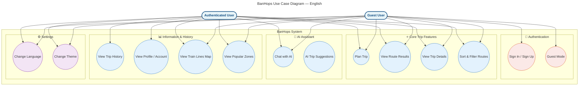
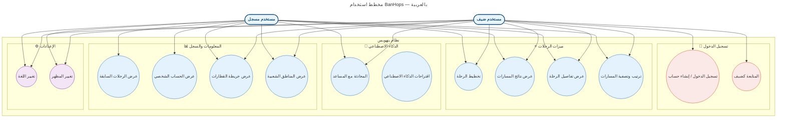

```mermaid
---
title: BanHops Use Case Diagram — English
---
flowchart TB
    classDef actor fill:#e8f4f8,stroke:#0F4C81,stroke-width:2px,color:#0F4C81,font-weight:bold
    classDef usecase fill:#fffde7,stroke:#f9a825,stroke-width:1px,color:#333
    classDef auth fill:#fbe9e7,stroke:#d84315,stroke-width:1px,color:#333
    classDef core fill:#e3f2fd,stroke:#1565c0,stroke-width:1px,color:#333
    classDef settings fill:#f3e5f5,stroke:#7b1fa2,stroke-width:1px,color:#333
    classDef groupTitle fill:none,stroke:none,font-weight:bold,font-size:14px

    G(["Guest User"]):::actor
    A(["Authenticated User"]):::actor

    subgraph System["BanHops System"]
        direction TB

        subgraph AuthGroup["🔐 Authentication"]
            UC9(("Sign In / Sign Up")):::auth
            UC14(("Guest Mode")):::auth
        end

        subgraph CoreGroup["⭐ Core Trip Features"]
            UC1(("Plan Trip")):::core
            UC2(("View Route Results")):::core
            UC3(("View Trip Details")):::core
            UC11(("Sort & Filter Routes")):::core
        end

        subgraph AIGroup["🤖 AI Assistant"]
            UC4(("Chat with AI")):::core
            UC10(("AI Trip Suggestions")):::core
        end

        subgraph InfoGroup["📊 Information & History"]
            UC5(("View Trip History")):::core
            UC6(("View Profile / Account")):::core
            UC12(("View Train Lines Map")):::core
            UC13(("View Popular Zones")):::core
        end

        subgraph SettingsGroup["⚙️ Settings"]
            UC7(("Change Language")):::settings
            UC8(("Change Theme")):::settings
        end
    end

    G --> UC1
    G --> UC2
    G --> UC3
    G --> UC4
    G --> UC7
    G --> UC8
    G --> UC12
    G --> UC11
    G --> UC13
    G --> UC9
    G --> UC14

    A --> UC1
    A --> UC2
    A --> UC3
    A --> UC4
    A --> UC7
    A --> UC8
    A --> UC12
    A --> UC11
    A --> UC13
    A --> UC5
    A --> UC6
```

---

```mermaid
---
title: مخطط استخدام BanHops — بالعربية
---
flowchart TB
    classDef actor fill:#e8f4f8,stroke:#0F4C81,stroke-width:2px,color:#0F4C81,font-weight:bold
    classDef usecase fill:#fffde7,stroke:#f9a825,stroke-width:1px,color:#333
    classDef auth fill:#fbe9e7,stroke:#d84315,stroke-width:1px,color:#333
    classDef core fill:#e3f2fd,stroke:#1565c0,stroke-width:1px,color:#333
    classDef settings fill:#f3e5f5,stroke:#7b1fa2,stroke-width:1px,color:#333

    G(["مستخدم ضيف"]):::actor
    A(["مستخدم مسجل"]):::actor

    subgraph System["نظام بنهوبس"]
        direction TB

        subgraph AuthGroup["🔐 تسجيل الدخول"]
            UC9(("تسجيل الدخول / إنشاء حساب")):::auth
            UC14(("المتابعة كضيف")):::auth
        end

        subgraph CoreGroup["⭐ ميزات الرحلات"]
            UC1(("تخطيط الرحلة")):::core
            UC2(("عرض نتائج المسارات")):::core
            UC3(("عرض تفاصيل الرحلة")):::core
            UC11(("ترتيب وتصفية المسارات")):::core
        end

        subgraph AIGroup["🤖 الذكاء الاصطناعي"]
            UC4(("المحادثة مع المساعد")):::core
            UC10(("اقتراحات الذكاء الاصطناعي")):::core
        end

        subgraph InfoGroup["📊 المعلومات والسجل"]
            UC5(("عرض الرحلات السابقة")):::core
            UC6(("عرض الحساب الشخصي")):::core
            UC12(("عرض خريطة القطارات")):::core
            UC13(("عرض المناطق الشعبية")):::core
        end

        subgraph SettingsGroup["⚙️ الإعدادات"]
            UC7(("تغيير اللغة")):::settings
            UC8(("تغيير المظهر")):::settings
        end
    end

    G --> UC1
    G --> UC2
    G --> UC3
    G --> UC4
    G --> UC7
    G --> UC8
    G --> UC12
    G --> UC11
    G --> UC13
    G --> UC9
    G --> UC14

    A --> UC1
    A --> UC2
    A --> UC3
    A --> UC4
    A --> UC7
    A --> UC8
    A --> UC12
    A --> UC11
    A --> UC13
    A --> UC5
    A --> UC6
```
