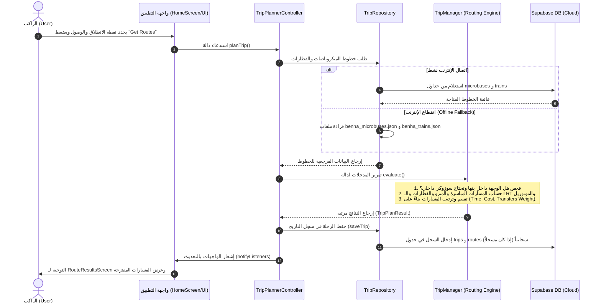
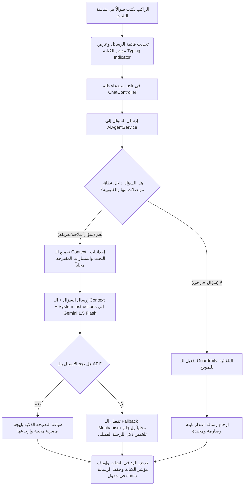
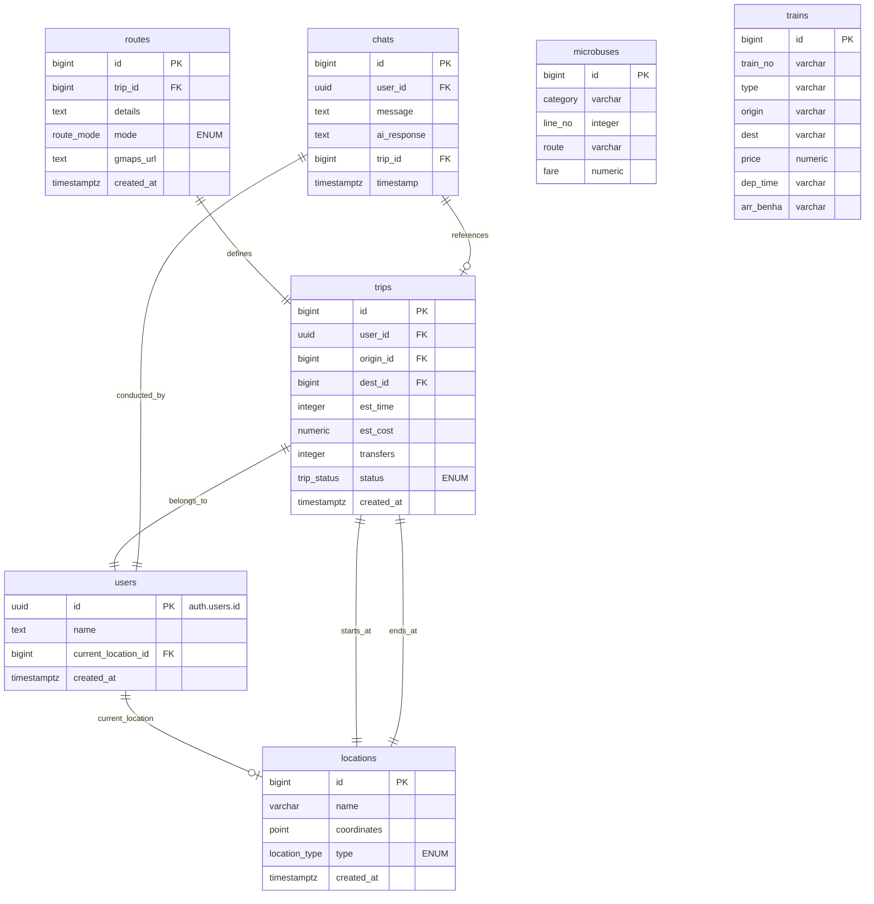

# تدفق العمل وقاعدة البيانات لمشروع بنهوبس (Workflow & Database Guide)

يحتوي هذا الملف على شرح تفصيلي لـ **دورة عمل النظام (Workflow)** وكيفية انتقال البيانات بين الشاشات والخدمات، بالإضافة إلى **معمارية قاعدة البيانات (Database Schema)** وجداولها وعلاقاتها البرمجية، مع الحفاظ على المصطلحات التقنية باللغة الإنجليزية.

---

## أولاً: تدفق عمل النظام (Operational Workflow)

يتمحور نظام بنهوبس حول دورتي عمل أساسيتين (Core User Journeys):

### 1. تدفق تخطيط الرحلات (Trip Planning Flow)

يوضح المخطط التالي كيفية انتقال الطلب من لحظة اختيار المستخدم لمحطة الانطلاق وحتى عرض إرشادات السير وحفظ الرحلة:

---

### 2. تدفق محادثة المساعد الذكي وحمايته (AI Chatbot & Guardrails Flow)

يوضح هذا التدفق كيف يتفاعل المستخدم مع الشات بوت، وكيف يتم حماية المساعد الذكي من الإجابة على الأسئلة الخارجية (Anti-Hallucination Guardrails):

---

## ثانياً: معمارية قاعدة البيانات (Database Schema - Supabase)

يعتمد التطبيق على قاعدة بيانات علائقية (Relational Database) تدار عبر **Supabase** ومبنية على محرك **PostgreSQL** القوي.

### 1. مخطط العلاقات البرمجية للجداول (Database ERD)

---

### 2. الشرح التفصيلي لجداول قاعدة البيانات وخصائصها التقنية

1. **جدول المواقع (`locations`):**
   - يخزن المحطات، المواقف، والجامعات.
   - يستخدم نوع بيانات هندسي خاص بنظام PostgreSQL وهو **`point`** لتخزين إحداثيات الـ GPS (خطوط العرض والطول) لدعم الحسابات الجغرافية بدقة.
   - حقل `type` هو عبارة عن **`ENUM`** مخصص يقبل قيم محددة فقط (University, Hospital, Station, Hub, Restaurant, Cafe).

2. **جدول المستخدمين (`users`):**
   - يرتبط بعلاقة رأس برأس (1:1) مع جدول المصادقة التلقائي في المنصة `auth.users` عبر حقل المعرّف الفريد `id` (من نوع UUID).
   - يتم التحكم بمزامنة البيانات تلقائياً عند تسجيل حساب جديد باستخدام **Database Trigger** يقوم بتنفيذ وظيفة `handle_new_user()` لحفظ اسم المستخدم وتفاديه للأخطاء.

3. **جدول الرحلات (`trips`):**
   - يسجل سجل عمليات البحث والتخطيط المكتملة.
   - يرتبط بجدول المستخدمين (`user_id`) وجدول المواقع كـ Foreign Keys مرتين: الأولى لنقطة البداية (`origin_id`) والثانية لنقطة الوصول (`dest_id`).
   - يحتوي على قيود حماية (Constraints) لمنع إدخال بيانات خاطئة، مثل التأكد من أن نقطة البداية لا تطابق نقطة النهاية (`origin_id <> dest_id`).

4. **جدول تفاصيل المسار (`routes`):**
   - يسجل الخطوات التفصيلية للرحلة؛ حيث ترتبط كل رحلة في جدول `trips` بعدة مسارات فرعية في هذا الجدول (علاقة 1:N).
   - يحتوي على روابط خرائط جوجل المباشرة (`gmaps_url`) ووسيلة الانتقال المستخدمة.

5. **جدول المحادثات (`chats`):**
   - يخزن الأسئلة والردود التاريخية للمساعد الذكي لتمكين المستخدم من العودة وقراءة استفساراته السابقة.
   - يحتوي على علاقة اختيارية (Nullable FK) مع جدول الرحلات (`trip_id`) لمعرفة هل المحادثة كانت تستعلم عن رحلة معينة محتسبة أم استعلام عام.

6. **جدول القطارات والميكروباصات (`trains` & `microbuses`):**
   - جداول مرجعية ثابتة (Read-Only Tables) للاستعلام السريع عن المواعيد والتعريفة المحدثة لعام 2026.
   - تحتوي على فهارس بحث (Database Indexes) لتسريع عمليات الفلترة والاسترجاع.

---

### 3. سياسات الأمان والحماية (Row-Level Security - RLS)

لضمان أقصى درجات الأمان وحماية البيانات وتوافقها مع المعايير المهنية:
* تم تفعيل الـ **RLS** على جداول `users`, `trips`, `routes`, `chats`.
* لا يمكن لأي مستخدم استعلام أو إضافة أو تعديل أي سجل في جدول الرحلات أو الشات إلا إذا كان يمتلك جلسة نشطة موثقة بـ JWT، وكان المعرف الفريد للمستخدم في التوكن يطابق معرف السجل الحقيقي (`auth.uid() = user_id`).
* تم جعل جداول الاستعلام العامة (`locations`, `microbuses`, `trains`) مقروءة للجميع دون قيود (`using (true)`) لتسهيل الاستعلام السريع حتى في وضع الضيف (Guest Mode).
